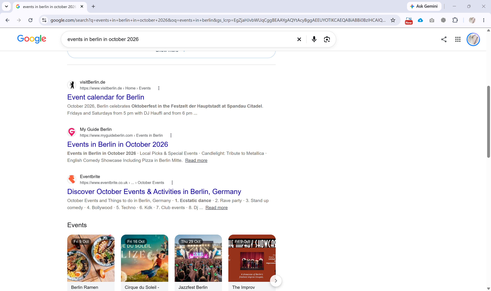
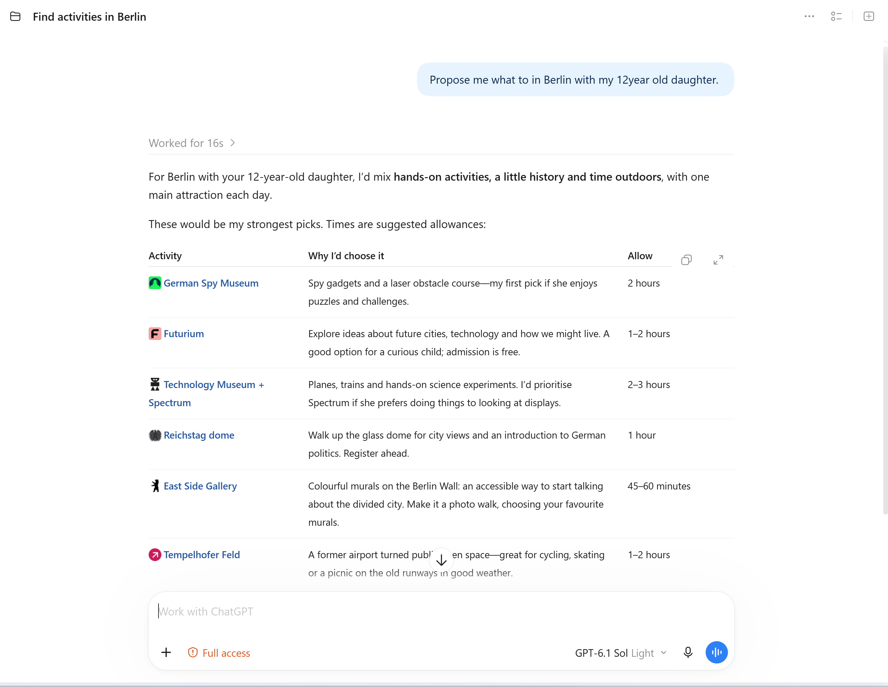
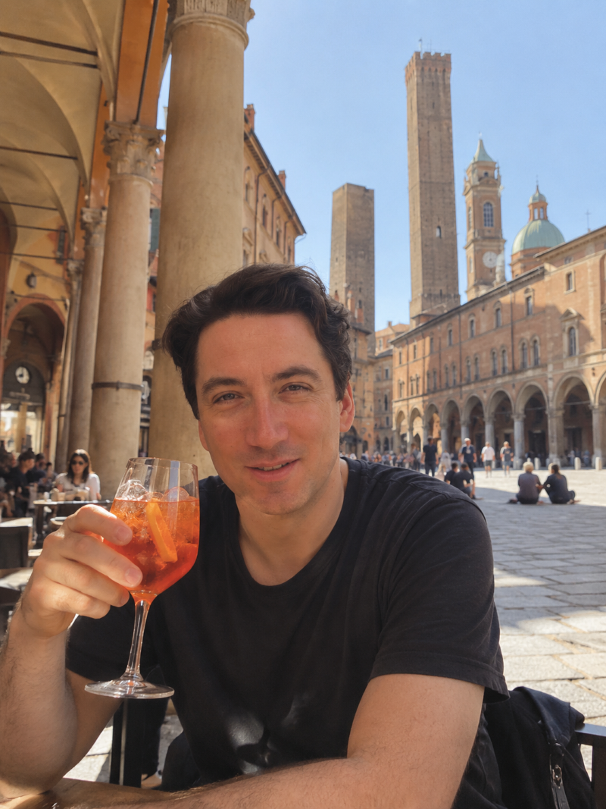
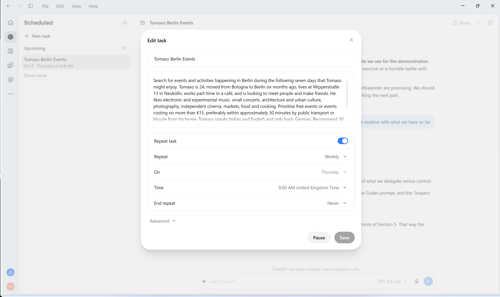
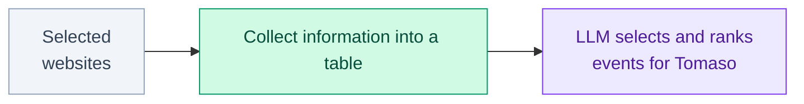
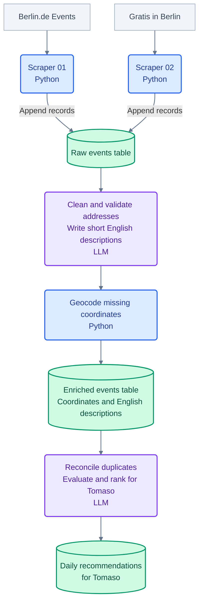
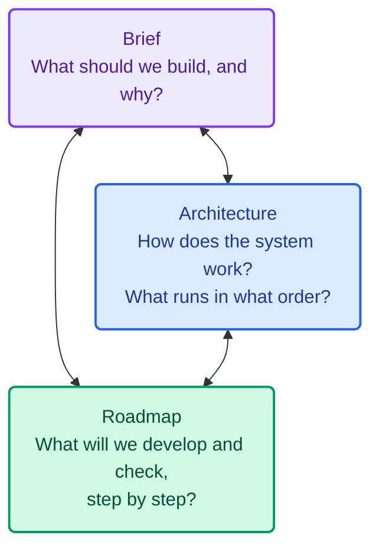

# Exercise 06 — Agentic Coding

## 1. Agentic Search

Conventional web search begins with a query. We enter a set of keywords, receive a ranked list of results, and decide for ourselves which sources and information are relevant.

**Agentic search starts with a brief rather than a query.**

We describe a task, a perspective and a desired outcome. An AI agent can then decide what to search for, which sources to inspect, how to interpret what it finds, and how to structure the result.

This places agentic search somewhere between **retrieval and simulation**. It does not simply ask what exists in a city. It can ask what becomes relevant **for a particular person, in a particular place, at a particular time**.

For urban research, this is interesting because the same city can be searched from very different positions. Age, income, mobility, language, interests and social circumstances all change what the city appears to offer.

In this exercise we will explore this through a fictional resident called Tomaso:

> **What should Tomaso do in Berlin this weekend?**

We will begin by giving an AI agent considerable freedom to answer this question. We will then examine how it searched, what it ignored, which assumptions it made, and whether its results can be trusted. Finally, we will progressively take control of parts of the process ourselves.

The aim is therefore not simply to use an AI agent, but to understand **what changes when search itself becomes agentic**.

## 2. Meet Tomaso

**Tomaso Bianchi** is a 24-year-old Italian who moved from Bologna to Berlin six months ago. He lives at **Wipperstraße 13 in Neukölln** and works part-time in a café.

His income is limited, so he generally looks for **free activities or events costing no more than €15**. He doesn't own a car and travels by **walking, bicycle and public transport**. He prefers things within about **30 minutes of home**, although he is willing to travel further for something exceptional.

Tomaso speaks **Italian and English** and is learning German, but is not yet comfortable attending events that require fluent German.

He is interested in **electronic and experimental music, small concerts, architecture and urban culture, photography, independent cinema, markets, food and cooking**. He enjoys discovering less obvious parts of Berlin rather than conventional tourist attractions or large commercial events.

Most importantly, Tomaso is **still building a social life in Berlin**. He would like to meet new people and make friends, so he particularly values events and activities that encourage **conversation, participation or repeated encounters**, rather than simply attending as a spectator.

Because he works irregular shifts, **evenings and weekends** are usually the best times for him.

## 3. Your First Agent

Instead of searching for events ourselves, we can ask ChatGPT to do this repeatedly on Tomaso's behalf:

> **Every Thursday, find things Tomaso could do in Berlin during the coming week.**

We can turn this into a **scheduled task** in ChatGPT. No Python is required. We describe the goal in natural language and tell the agent when it should run.

### Exercise

Create a new scheduled task in ChatGPT using a prompt similar to:

> Every Thursday, search for events and activities happening in Berlin during the following seven days that Tomaso might enjoy.
>
> Tomaso is 24, moved from Bologna to Berlin six months ago, lives at Wipperstraße 13 in Neukölln, works part-time in a café, and is looking to meet people and make friends. He likes electronic and experimental music, small concerts, architecture and urban culture, photography, independent cinema, markets, food and cooking.
>
> Prioritise free events or events costing no more than €15, preferably within approximately 30 minutes by public transport or bicycle from his home. Tomaso speaks Italian and English and only basic German.
>
> Recommend 10 activities. For each recommendation provide the **event name, date, time, venue, full address, latitude, longitude, price, original source URL, and a short explanation of why it suits Tomaso**. Give latitude and longitude in **decimal degrees** and identify the event venue as accurately as possible.

The requested output has a simple spatial data structure:

`event | date | time | venue | address | latitude | longitude | price | source_url | recommendation`

> **Run the task once and examine the results.**

### Reference run — 4 October 2026

We tested the brief with a live search for **5–11 October 2026**. The table below is kept as a reference example of the agent's output. It is useful precisely because it is not perfectly clean: some information can be verified directly, while other fields depend on interpretation or secondary lookup.

| Event | Date / time | Venue / address | Lat | Lon | Price | Why it fits Tomaso | Source |
|---|---|---|---:|---:|---|---|---|
| Creative Media Lab | Wed 07.10, 16:00–18:00 | Medienkompetenzzentrum Neukölln, Mittelweg 30, 12053 Berlin | 52.47475 | 13.43519 | Free | Hands-on media workshop involving film, VR and 3D printing; local and participatory. | https://jup.berlin/events/creative-media-lab |
| Open Calligraphy Workshop | Thu 08.10, 16:00–20:00 | Stadtteilzentrum Kiezbegegnung, Warthestraße 73, 12051 Berlin | 52.47017 | 13.42693 | Free | Drop-in creative activity with no prior knowledge required; strong potential for informal interaction. | https://www.gratis-in-berlin.de/component/flexicontent/36-kunst/2072643-offene-kalligraphie-werkstatt-in-neukoelln |
| Open Lab: Recycling, Repackaged | Thu 08.10, 17:00–20:00 | Futurium, Alexanderufer 2, 10117 Berlin | — | — | Free | Participatory workshop combining AI, design and future thinking; further away, but unusually close to Tomaso's interests. | https://www.berlin.de/en/tickets/education-lectures/open-lab-evening-recycling-repackaged/2026-10-08-n-a-b5bf2e04-fc8f-4013-a4f2-1dd82832cd61/ |
| 52nd Berlin Night of Spiritual Songs | Fri 09.10, 19:30–23:00 | Martin-Luther-Kirche, Fuldastraße 50, 12045 Berlin | 52.48431 | 13.43584 | Free / donation | Collective singing rather than passive spectatorship; very local and explicitly social. | https://www.eli-berlin.de/liedernacht/ |
| Big Band Night 2026 | Fri 09.10, 19:30 | Kulturstall, Schloss & Gutshof Britz, Alt-Britz 81, 12359 Berlin | 52.4469 | 13.4378 | Free / pay what you can | Live music in Neukölln with a low financial barrier. | https://www.berlin.de/musikschule-neukoelln/veranstaltungen/big-band-night-1295669.php |
| Sound Canteen w/ Tobi Fries | Fri 09.10, 20:00 | Orangerie Neukölln, Schierker Straße 8, 12051 Berlin | 52.47058 | 13.43609 | Free | Ambient/Balearic music in a small local venue; close to Tomaso's electronic-music interests. | https://www.orangerie-nk.de/ |
| Klangstraße Music Festival | Fri 09.10, 15:00–21:00 | Multiple venues along Residenzstraße, 13409 Berlin | — | — | Free | 27 short concerts across 15 locations; further away, but informal, exploratory and easy to move between. | https://www.berlin.de/events/7755495-2229501-reinickendorfer-klangstrasse.html |
| Gartenrundgang | Sat 10.10, 11:00–13:00 | KGA Zufriedenheit, Koppelweg 30, 12347 Berlin | — | — | Free | Urban gardening, discussion and shared knowledge in a relaxed setting; strong social potential. | https://www.umweltkalender-berlin.de/angebote/details/99663?dat=2026-10-10 |
| Mit allen Sinnen im Waldgarten | Sat 10.10, 15:00–16:30 | Waldgarten Berlin-Britz, Leonberger Ring 54, 12349 Berlin | 52.42721 | 13.42883 | Free | Guided sensory walk through a community garden; participatory and locally grounded. Registration required. | https://www.umweltkalender-berlin.de/angebote/details/99821?dat=2026-10-10 |
| Gardens of Disco | Sat 10.10, 21:00 | Orangerie Neukölln, Schierker Straße 8, 12051 Berlin | 52.47058 | 13.43609 | €12 | Small-scale Disco, Italo, House and experimental electronic music in a local setting; probably the strongest music match. | https://www.orangerie-nk.de/ |

### First observations

At first sight, the result is impressive. The agent has searched for current events, interpreted Tomaso's preferences and returned structured spatial data. But the table also exposes the limits of the process.

Not every requested field is equally reliable. Proximity to Tomaso's home may be inferred from a neighbourhood rather than calculated as travel time. The likelihood of meeting people is an interpretation of an event description. Coordinates may require a second lookup, and for distributed events such as **Klangstraße**, a single coordinate may be the wrong representation altogether. Unresolved coordinates are therefore left blank rather than given false precision.

The search also combines very different kinds of sources: event aggregators, neighbourhood websites, public calendars and individual organisers. The agent decides which sources to search, which results to ignore and which events to recommend.

Checking the results can change the answer. An apparently suitable creative workshop from an earlier search turned out to be intended for **10–18 year olds**. **MUSK ON MARS**, another strong-looking recommendation, was listed from **€20** and therefore exceeded Tomaso's €15 budget.

The result is not necessarily bad. Many recommendations are useful. The problem is that the **method is opaque**.

We know the brief and we can see the output, but we do not yet know exactly how the agent moved from one to the other.

> **What actually happened?**

## 4. Inside the Search

Our first agent appears simple. We gave it a description of Tomaso and received ten recommendations.

But between those two things, quite a lot happened.

**Tomaso's brief → Search → Sources → Extraction → Interpretation → Filtering → Ranking → Output**

The agent had to decide:

- **where to search** — which websites, calendars and event platforms to inspect;
- **what to extract** — dates, prices, addresses, coordinates and descriptions;
- **what to interpret** — whether an event feels social, interesting or appropriate for Tomaso;
- **what to exclude** — events that are too expensive, too far away, require fluent German or otherwise conflict with the brief;
- **how to rank** — which ten events are ultimately worth recommending.

In our first experiment, all of these decisions were bundled together inside a single agentic search.

We defined the **input** — Tomaso — and the **output** — ten recommendations — but we had very little control over what happened in between.

That is powerful, but it also creates a methodological problem.

> **Which parts of this process should we delegate to AI, and which parts should we control ourselves?**

### Taking control of the search

One obvious place to intervene is at the beginning.

Instead of asking an agent to decide **where on the web to search**, we can define the sources ourselves.

For example:

**Known Berlin websites → collect events → structured dataset**

Now we know where the information came from. We can inspect the original pages, repeat the process later, and compare what different sources contribute.

This changes the role of AI. Rather than asking it to perform the entire search, we can use it to help us **build the search process itself**.

## 5. Building a Controlled Search

We now choose the sources ourselves and use **Codex as a coding agent** to help build the collection process. First understand the overall system; then write a brief and develop it one step at a time.

### 5.1 Overall Architecture

We will build a system that collects event information from selected websites, combines it into a large table, and gives that table to an LLM. The LLM then selects and ranks events that match Tomaso's interests and circumstances.

Each website needs its own **scraper**: a Python script that extracts event information. Websites organise their pages differently, so each scraper must be adapted to its source. All scrapers return the same set of fields, allowing their results to be added to one shared events table.

Why a table? A website contains navigation, adverts, formatting and other material alongside its events. Extracting the relevant information into rows and columns gives us a consistent dataset: each row represents an event, with fields such as its date, venue, address, price and description. This makes it easier to inspect and compare events, combine information from many sources, and enrich the data with cleaned addresses, English descriptions and coordinates before asking the LLM to make recommendations.

**For this tutorial, we will build just two scrapers:** one for [Berlin.de Events](https://www.berlin.de/en/events/) and one for [Gratis in Berlin](https://www.gratis-in-berlin.de/). The same architecture could later include more websites, each contributing records to the shared table.

**Color key:** Blue = Python script · Green = table · Purple = LLM action.

The eventual pipeline should run **every Monday**, collecting events from **Monday through Sunday of that week**, using Berlin local dates. Build and check the manual pipeline before adding automation. **This tutorial builds only the two scrapers**; the diagram shows how their outputs will support the later stages.

### 5.2 Development Brief

Give Codex a clear brief before asking it to write code:

> Develop this system in stages, following the roadmap in Section 5.3. Implement and check one stage before moving to the next; this tutorial builds only the two scrapers and combines their outputs. Revise the plan as we learn while keeping the goal of recommendations for Tomaso clear.
>
> Build two Python scrapers: Scraper 01 for Berlin.de Events and Scraper 02 for Gratis in Berlin. Both must accept the same Monday–Sunday date range and append records using an identical CSV schema to a raw/master events table.
>
> Collect all available factual event information in that period, including details from individual event pages where needed. Do not select events for Tomaso and do not deduplicate within or between sources. Preserve provenance and leave unavailable information blank rather than inventing it.
>
> Use latitude and longitude supplied by the source when available, in decimal degrees. Otherwise leave them blank for the later shared geocoding stage. Do not geocode inside either scraper.
>
> In the later shared enrichment stage, use the LLM to clean addresses and write a short factual English description of each event from its source text. Preserve the original German description and address, keep official street and venue names, and flag missing or uncertain details rather than inventing them.
>
> First inspect both websites and propose how to collect their data. Explain which pages you will access, how you will identify events and dates, which fields are available, and what could cause collection to fail. Implement one scraper at a time after we review the proposal.

Use this shared schema:

`event | date | end_date | time | end_time | venue | address | latitude | longitude | price | category | description | language | age_restrictions | registration | source | source_url | collected_at`

Use `YYYY-MM-DD` for dates and consistent column names and order in both outputs. Keep source wording where useful, including price conditions, language requirements and registration details. `source` identifies the website; `source_url` links to the event page; `collected_at` records when it was collected. These fields let us check the dataset against its sources.

Later enrichment should preserve the original `address` and `description` and add `cleaned_address`, `description_en`, coordinate provenance and geocoding status. The LLM writes `description_en` as one or two factual English sentences based on the source; this describes the event rather than recommending it for Tomaso. Ambiguous or unresolved locations remain flagged for review; a coordinate alone does not establish travel time from Tomaso's home.

### 5.3 Development Steps

Develop one stage at a time. The prompts below are starting points; use the shared schema and brief from Section 5.2 throughout. **The tutorial implements steps 1–4; steps 5–7 describe later development.**

1. **Inspect both sources.** Open listings and individual event pages. Review date coverage, pagination, available fields and likely failure points.

   > Inspect Berlin.de Events and Gratis in Berlin. Explain how each scraper could collect events for a Monday–Sunday week. Identify which fields come directly from the pages and which are unavailable. Propose an approach before writing code.

2. **Build Scraper 01.** Run it manually for one explicit week and compare sample rows with the original pages.

   > Implement the Berlin.de scraper using our shared schema and a configurable Monday–Sunday date range. Preserve source facts and links, leave missing values blank, and do not filter for Tomaso or deduplicate. Explain how to run it and check its output.

3. **Build Scraper 02.** Use exactly the same schema and date range, adapting extraction to the second website.

   > Implement the Gratis in Berlin scraper with the same output columns and date range as Scraper 01. Adapt it to this website's structure. Run it and check sample rows against the source pages.

4. **Combine and inspect.** Append both outputs to the raw/master events table and check consistency and coverage.

   > Combine the two scraper outputs into one raw events table. Check column names, date coverage and missing values. Retain overlapping event records and their source references, and report any collection problems.

5. **Later: enrich the data.** Clean addresses and write English descriptions with the LLM, then geocode missing coordinates with Python.

   > Preserve the original addresses and descriptions. Add cleaned addresses and short factual English descriptions using the LLM. Then use Python to geocode only missing coordinates, record their provenance, and flag unresolved locations for review. Save an enriched events table.

6. **Later: evaluate with the LLM.** Check its recommendations against the enriched data and source pages.

   > Read the enriched events table and Tomaso's profile in Section 2. Recognise and reconcile duplicate events while retaining source references. Filter and rank suitable events, then return a table of daily recommendations with a short explanation for each. Identify uncertain information.

7. **Finally: automate.** Complete and check the manual pipeline before scheduling it.

   > The manual pipeline has been checked. Schedule it to run every Monday, using Berlin local dates to collect events from Monday through Sunday of that week. Record failures so we can review incomplete runs.

### Why prepare before coding?

Before implementation, it helps to have three connected parts:

The **brief** defines the intended outcome. The **architecture** explains the system and its execution order. The **roadmap** sets out the stages in which we will build and check it. Together, they give us a way to judge whether each change still serves the original purpose.

In a typical ChatGPT workflow, we would discuss these in a normal conversation with the LLM before moving into implementation with the coding agent. They do not need to be perfect before we start, but they should be clear enough to guide the next step.

**All three should be reviewed and adjusted during development.** What we learn from a website, an initial scraper or a failed run may change the design or the next development step. Update the relevant parts together and check each revision against the intended outcome. This lets the project evolve without drifting into unrelated features or a collection of changes that no longer work together.

You can skip this preparation, but doing it helps you understand what the agent is building and keep the results aligned with what you wanted to achieve.

If you work in a **GitHub repository**, save each working stage as a commit before moving on. These checkpoints let you inspect changes and roll back to a known working version if something goes wrong. Only changes saved in version control can be recovered this way.

**First we used an agent as the search engine. Now we use an agent to help us construct the search engine.**
