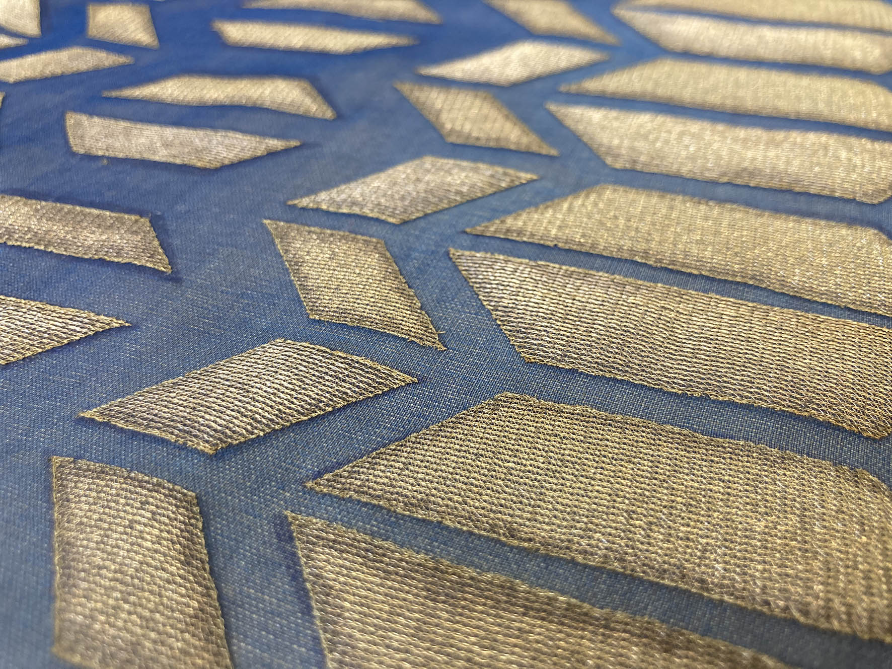
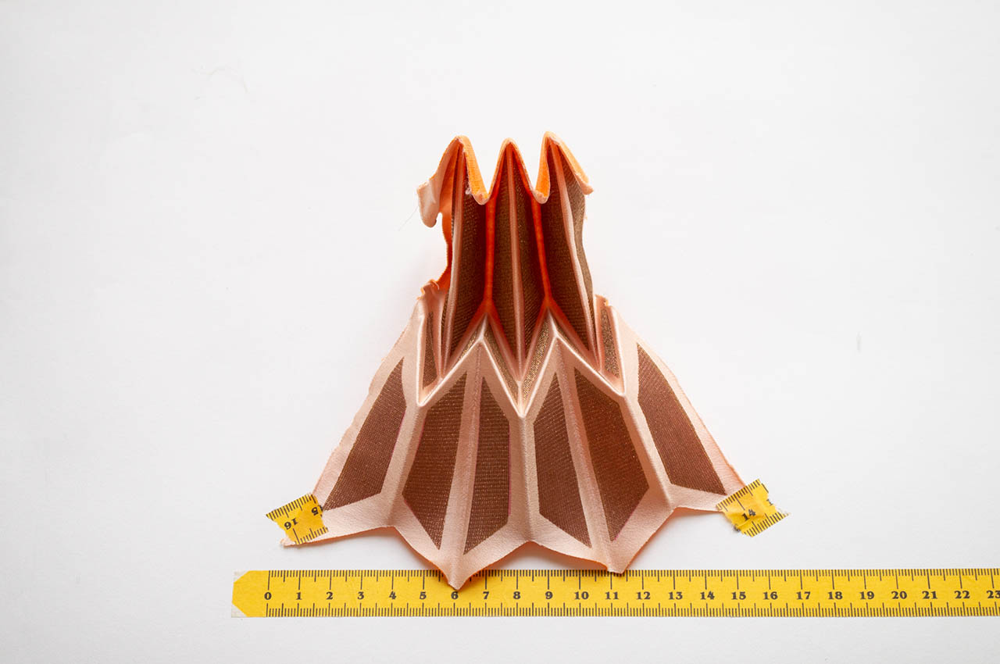

# Skills Module Pervasive Urbanism 2026–27

*Cartographies of Affect: Between Destinations, 2024/26*

# Dates
|  Nr | Date       | Module     | Topic                                    | Time          | Location              |
| --: | ---------- | ---------- | ---------------------------------------- | ------------- | --------------------- |
|   1 | 30.10.2026 | Module 1.1 | Cartographies of Affect: Python 101      | 14:00 - 18:00 | tbc |
|   2 | 06.11.2026 | Module 2.1 | Prosthetic Clouds: Arduino 101           | 14:00 - 18:00 | tbc |
|   3 | 20.11.2026 | Module 2.2 | Prosthetic Clouds: Sensors and Actuators | 14:00 - 18:00 | tbc |
|   4 | 27.11.2026 | Module 3.1 | Textiles - Sensing surfaces              | 10:30 - 16:30 | tbc |
|   5 | 04.12.2026 | Module 3.2 | Textiles - Sensing surfaces              | 10:30 - 16:30 | tbc|
|   6 | 11.12.2026 | Module 2.3 | Prosthetic Clouds: Design, Fabrication and Data Communication    | 14:00 - 18:00 | tbc |
|   7 | 18.12.2026 | Module 1.2 | Cartographies of Affect: Data Mining and Agentic Coding | 14:00 - 18:00 | tbc|
|   8 | 15.01.2027 | Module 1.3 | Cartographies of Affect: Geodata in Grasshopper | 14:00 - 18:00 | tbc |

# SKILLS MODULES

## Skills Module 1: Cartographies of Affect

[Module resources](Module-1-Cartographies-of-Affect/README.md)

In this module, we will explore **desktop-based data-mining techniques**, starting with publicly available sources such as the **London Datastore**, and learn how to **process and visualize different data formats**.

You will also learn how to **extract and analyse data** from platforms like **Flickr** or **Google**, transforming digital traces into spatial insight. We will apply **text- and image-based sentiment analysis**, as well as introduce **machine-learning methods for object recognition** on the collected datasets.

All tasks will be carried out using a combination of **Python**, **Rhino/Grasshopper**, and **Adobe Illustrator**.

### Skills Module 1.1: Python 101

An **introduction to Python** — we will explore different IDEs, set up your working environment, and take the first steps in programming.
This session establishes the **foundation** for all subsequent lessons in this module.

### Skills Module 1.2: Data Mining and Agentic Coding

We will explore how to **collect, organise and analyse urban data in Python**. The exercises introduce **Pandas** for working with tables, graphs for exploring patterns, **Folium** for mapping, the **Flickr API** for collecting geotagged photographs, and text-based **sentiment analysis**.

We will also introduce **agentic coding**, using an AI assistant to help develop a data-collection and analysis workflow. You will learn to define a research question, guide the assistant through manageable tasks, check sources and generated code, and verify that the results answer your original question. The emphasis is on understanding and directing the process.

[Session examples](Module-1-Cartographies-of-Affect/Skills%201%20-%20Day%202%20Datamining%20Python/)

### Skills Module 1.3: Geodata in Grasshopper

This session brings collected data into **Rhino/Grasshopper** for spatial analysis and representation. We will explore importing text and coordinate files, **OpenStreetMap data**, raster images and shapefiles, and using **Heron** to work with mapping and topography. Grid-sampling exercises show how image and terrain values can be translated into geometry, building towards a complete spatial visualisation.

The examples also introduce **image analysis in Python**, including object detection and image-to-text workflows, as further ways to investigate the content of urban imagery. We will consider how computational findings can inform a map or spatial narrative, and how to communicate them clearly through graphics.

[Session examples](Module-1-Cartographies-of-Affect/Skills%201%20-%20Day%203%20Geodata%20in%20Grasshopper/)

### Module 1 assignment: Urban data investigation

**Find an online dataset, build a structured database and visualise it to investigate a question about a chosen area.** You might study events within a neighbourhood, Flickr photographs over a defined period, or the distribution of shops and other infrastructure. Define the area, time period and purpose of your investigation before collecting the data.

Document your sources and collection method, organise and check the data, and develop maps, graphs or spatial representations that communicate your findings. Explain what your dataset reveals, what it leaves out and how those limitations affect your interpretation. AI assistance may support the workflow, but you must understand and be able to explain the process.

**Technical execution, research intention, graphic quality and narrative all matter.** Present a clear relationship between your question, the method you chose and the story supported by your results. This work will form part of your presentation and discussion in the final oral examination.

## Skills Module 2: Prosthetic Clouds

[Module resources](Module-2-Prosthetic-Clouds/README.md)

This module focuses on designing a **wearable prototype** that acts as a prosthetic interface between your body and the urban environment. Using **microcontrollers and Arduino**, you will create sensors and actuators that respond to, and influence, your perception of the city.

Through **GPS integration**, the devices will be able to track time and location, while events can be **logged or transmitted** directly to a computer. You will also learn how to **visualize and represent the recorded data** within **Rhino/Grasshopper**.

*A list of required components for purchase will be added to the repository.*

### Skills Module 2.1: Arduino 101

We will introduce the **Arduino ecosystem** and the **Arduino IDE**, covering the different types of boards, how they work, and how to program them.
The focus of this session is the **Arduino coding language**, which is based on **C/C++**, and forms the foundation for prototyping interactive devices.

### Skills Module 2.2: Sensors and Actuators

In this session, we’ll explore the **physical side of interaction** — the types of sensors available, how to connect them, and how to interpret and record their readings.
We’ll also look at how to **combine multiple data streams**, such as **GPS coordinates**, **galvanic skin response**, or **heartbeat sensors**, to capture and map embodied experiences of the city.

### Skills Module 2.3: Design, Fabrication and Data Communication

This session connects **code, electronics and the physical design of your wearable prototype**. We will consider component placement, wiring, power, assembly and body fit, then explore fabrication approaches including **laser cutting, 3D printing, prototyping boards and soldering**, with PCB design as a further option.

The examples also show how to connect your prototype to **Python and Grasshopper** through serial communication and wireless data exchange using **UDP/OSC**. We will explore receiving, recording and representing sensor values, alongside examples of using phone sensors and sending data to cloud services. The aim is to build a coherent system whose physical construction, sensing behaviour and data workflow support your investigation.

[Session examples](Module-2-Prosthetic-Clouds/Skills%202%20-%20Day%203%20Design%20to%20Fabrication/)

### Module 2 assignment: Wearable urban data logger

**Design and build your own Arduino-based sensing device that records sensor measurements together with GPS coordinates and timestamps.** Choose or develop a sensor appropriate to a question about your experience of the city, and explain why its measurements are relevant. Integrate the sensor and GPS into a portable prototype, considering how it is worn or carried and how its components are assembled.

Test your logger before fieldwork, then undertake **several walks** to collect data. Record the route and conditions for each walk, check the quality of the sensor readings and GPS positions, and save the data in a structured format that can be analysed in Python or Rhino/Grasshopper.

Develop **maps and visualisations** that relate your measurements to location and time, and compare the walks. Explain the behaviour of your sensor, the logic of the logging code, any gaps or inaccuracies in the data, and what the results suggest about the urban conditions or experiences you set out to investigate. Present the prototype, data workflow and findings in the final oral examination.

## Skills Module 3: Textile Workshop - Sensing surfaces

[Workshop materials list](Module-3-Textiles-Sensing-Surfaces/README.md)

**Tutor: Arantza Vilas**

*Sensing surfaces: sculpting on the body and fabric manipulation for dynamic, sensing wearables.*

*Pleated e-textiles project by Arantza Vilas in collaboration with Wearables Computing Research team at UdK (Berlin) coordinated by Berit Greinke.*

This seminar will introduce the students to principles of draping soft materials on the body and consider silhouette, movement and form as well as studying draping behaviour, not only in aesthetic terms but also in relation to scale and motion.

### Skills Module 3.1
The second part of the seminar will introduce ways of creating soft, dynamic, articulated surfaces with pleats and consider how these can be incorporated and draped on the body creating connections with silhouettes previously created. This work will serve as a basis to study movement and potential sensing areas.

### Skills Module 3.2
A second part of the seminar will cover the craft of pleating and how to transfer folds onto textiles and other soft materials and study their body placement and articulation.

The experimentation will be complemented with contextual understanding of how these principles work in fashion and costume disciplines.

## Resources

See the [RC15 resources guide](Resources.md) for software setup, further learning materials, mapping and visual references, data sources, B-Made inductions, equipment and Arduino suppliers. Use it to prepare for tutorials and find tools relevant to your projects; it will be updated as the modules develop.

## Studio etiquette

Please read the [RC15 etiquette guide](RC15_ETIQUETTE.md) for expectations around collaboration, tutorial participation, communication and safeguarding your work.

## GitHub

We use this **GitHub repository** to store and share sample code, links, and materials related to the skills modules. It will serve as the **central access point** for all tutorial resources.

The repository will be updated regularly. Please check it frequently. You can **fork the repository** to your computer and **sync updates** when needed.

If you are new to GitHub, we recommend installing [GitHub Desktop](https://desktop.github.com/) and reviewing the [getting started guide](https://docs.github.com/en/desktop/overview/getting-started-with-github-desktop).

# Foundation Skills for RC15 — LinkedIn Learning

The first weeks of RC15 should be used to become familiar with the basic software and technical skills needed for the studio. **The three RC15 Foundations learning paths below are required for all students.** Complete all courses within these paths in full during the first three weeks.

| Learning path | Focus | Completion deadline |
| --- | --- | --- |
| RC15 Foundations 1 – 3D Modelling | Rhino and Grasshopper | 3 November 2026 |
| RC15 Foundations 2 – Coding and Physical Computing | Python and Arduino | 10 November 2026 |
| RC15 Foundations 3 – Visual Communication & Presentation | Layout, colour, storytelling and confident presentation | 17 November 2026 |

**RC15 Recommended – Mapping with QGIS** is an additional recommended path, with no compulsory deadline. Working with maps and spatial data is an important part of RC15; students unfamiliar with QGIS are encouraged to complete the introductory content before their first mapping task, and explore the advanced content when relevant to their projects.

Access to **LinkedIn Learning is included through your UCL account**. Sign in using your UCL email address. A separate invitation will be sent to you to join the learning paths. **We can check your viewing and completion progress through LinkedIn Learning**, so please use your UCL account when completing the courses.

The aim is twofold: to establish a shared foundation in software skills across the studio, and to give you time to become familiar with the key technical skills that are central to RC15. Working through these courses early will help you engage with the studio's methods and develop your projects with greater independence.

The skills tutorials will revisit some of these basics, including introductions to **Python and Arduino**. However, tutorial time is valuable, and we cannot devote every session to comprehensive software introductions. Please familiarise yourself with the relevant course content **before each tutorial**, even if the learning path's completion deadline falls later, so that we can use our time together for questions, experimentation and applying these skills to your work.

# AI-Assisted Coding and Assessment

The RC15 skills tutorials follow [UCL's framework for generative AI in assessment](https://www.ucl.ac.uk/teaching-learning/generative-ai-hub/three-categories-genai-use-assessment). UCL distinguishes between different uses of AI, with permissions defined for each assessment. For our skills work, **AI tools such as ChatGPT and Codex may be used as assistants**, within the conditions set out in the assessment brief. You remain responsible for your work and must acknowledge how you have used AI, following [UCL's guidance for students](https://www.ucl.ac.uk/study/current-students/exams-and-assessments/assessment-success-guide/engaging-generative-ai-your-education-and-assessment).

Large language models (LLMs) can support you in developing, explaining, debugging and testing code. We will teach aspects of **vibe coding**: developing code through an iterative exchange of instructions, generated code, testing and revision. This is part of learning how to work critically with these tools.

There is still an essential educational purpose to learning Python and computational methods. **AI-assisted coding requires an understanding of code and computational logic.** You need to define the problem, break it into meaningful steps, guide the model, understand the important parts of its output, and test whether the result meets your original goals. A script that runs successfully may still use an unsuitable method or produce misleading results. You must be able to explain your choices, recognise limitations and check the output against your intentions.

The rise of LLMs has shifted our attention. A few years ago, an intricate piece of code might itself have been impressive evidence of technical skill. Today, complexity alone tells us much less about your understanding. Our attention is on **intention, method and result**: what you set out to investigate, why you chose a particular approach, how you tested it, and what the outcome demonstrates. These questions apply whether you wrote the code independently or developed it with AI assistance.

## Final assessment: oral examination

**The final assessment of the skills module will be an oral examination, replacing the previous PDF submission.** You will present your work, explain how it functions and discuss it with us through questions. Be prepared to explain your computational logic, methods and decisions, how you checked your results, and where AI contributed to the process. You must demonstrate your own understanding when answering questions.

The oral examination allows us to assess what you have learned and how you apply it. Full assessment requirements will be provided in the assessment brief.

## YouTube

Recordings of the 2026–27 skills tutorials will be linked here once available.

Recordings from previous years can be used as extended material:

- [Skills 2024/25](https://www.youtube.com/playlist?list=PL0TJgiFZ0aRLwPoAfxv-mIsKGgSE3zlBg)
- [Skills 2023/24](https://www.youtube.com/playlist?list=PL0TJgiFZ0aRLx7_uol3rhIsS53ecXHYlr)
