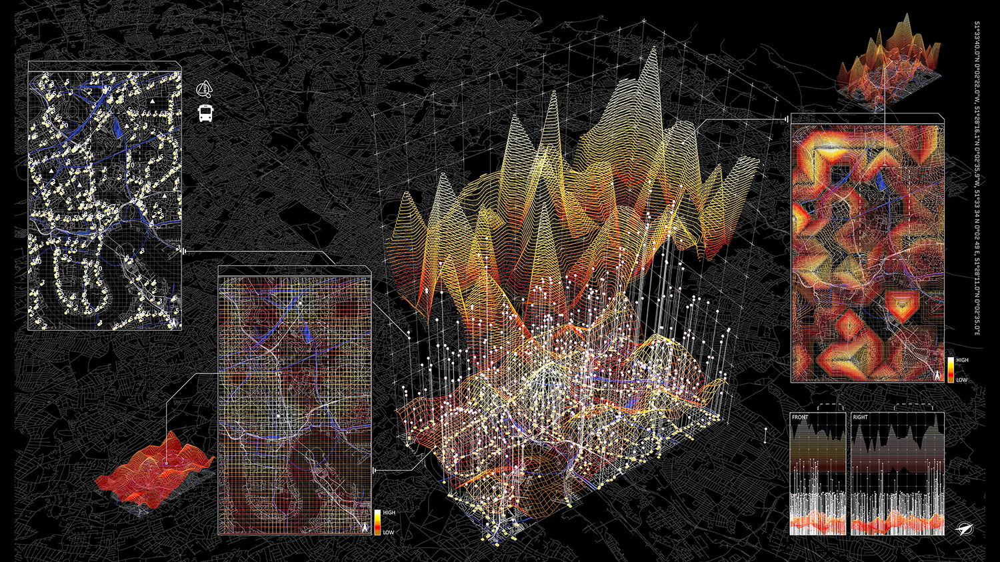

# Skills Module Pervasive Urbanism 2026–27

*Cartographies of Affect: Between Destinations, 2024/26*

# Dates
|  Nr | Date       | Module     | Topic                                    | Time          | Location              |
| --: | ---------- | ---------- | ---------------------------------------- | ------------- | --------------------- |
|   1 | 30.10.2026 | Module 1.1 | Cartographies of Affect: Python 101      | 14:00 - 18:00 | tbc |
|   2 | 06.11.2026 | Module 2.1 | Prosthetic Clouds: Arduino 101           | 14:00 - 18:00 | tbc |
|   3 | 20.11.2026 | Module 2.2 | Prosthetic Clouds: Sensors and Actuators | 14:00 - 18:00 | tbc |
|   4 | 27.11.2026 | Module 3.1 | Textiles - Sensing surfaces              | 10:30 - 16:30 | tbc |
|   5 | 04.12.2026 | Module 3.2 | Textiles - Sensing surfaces              | 10:30 - 16:30 | tbc|
|   6 | 11.12.2026 | Module 2.3 | Prosthetic Clouds: Data Visualization    | 14:00 - 18:00 | tbc |
|   7 | 18.12.2026 | Module 1.2 | Cartographies of Affect: Data Mining     | 14:00 - 18:00 | tbc|
|   8 | 15.01.2027 | Module 1.3 | Cartographies of Affect: Agentic Coding  | 14:00 - 18:00 | tbc |

# SKILLS MODULES

## Skills Module 1: Cartographies of Affect

In this module, we will explore **desktop-based data-mining techniques**, starting with publicly available sources such as the **London Datastore**, and learn how to **process and visualize different data formats**.

You will also learn how to **extract and analyse data** from platforms like **Flickr** or **Google**, transforming digital traces into spatial insight. We will apply **text- and image-based sentiment analysis**, as well as introduce **machine-learning methods for object recognition** on the collected datasets.

All tasks will be carried out using a combination of **Python**, **Rhino/Grasshopper**, and **Adobe Illustrator**.

### Skills Module 1.1: Python 101

An **introduction to Python** — we will explore different IDEs, set up your working environment, and take the first steps in programming.
This session establishes the **foundation** for all subsequent lessons in this module.

### Skills Module 1.2: Data Mining

We will examine **data-mining techniques** and learn how to connect to **public APIs** such as **Flickr** or **Google**, collecting geotagged and textual information for spatial analysis.

### Skills Module 1.3: Agentic Coding

In this session, we will explore **agentic coding techniques**, starting with simple **search agents** and examining their capabilities and limitations. We will develop **frameworks and guardrails** for guiding their work and learn how to structure an **agentic urban search using ChatGPT**, with attention to defining research questions, checking sources, and reviewing results.

We will also introduce **vibe coding for Arduino**, exploring how AI-assisted code generation can support wearable prototyping and why generated code needs to be understood, tested, and refined.

## Skills Module 2: Prosthetic Clouds

This module focuses on designing a **wearable prototype** that acts as a prosthetic interface between your body and the urban environment. Using **microcontrollers and Arduino**, you will create sensors and actuators that respond to, and influence, your perception of the city.

Through **GPS integration**, the devices will be able to track time and location, while events can be **logged or transmitted** directly to a computer. You will also learn how to **visualize and represent the recorded data** within **Rhino/Grasshopper**.

*A list of required components for purchase will be added to the repository.*

### Skills Module 2.1: Arduino 101

We will introduce the **Arduino ecosystem** and the **Arduino IDE**, covering the different types of boards, how they work, and how to program them.
The focus of this session is the **Arduino coding language**, which is based on **C**, and forms the foundation for prototyping interactive devices.

### Skills Module 2.2: Sensors and Actuators

In this session, we’ll explore the **physical side of interaction** — the types of sensors available, how to connect them, and how to interpret and record their readings.
We’ll also look at how to **combine multiple data streams**, such as **GPS coordinates**, **galvanic skin response**, or **heartbeat sensors**, to capture and map embodied experiences of the city.

### Skills Module 2.3: Data Visualization

How can sensor readings be represented visually? This session focuses on **data visualization techniques in Rhino/Grasshopper**.
You will learn how to **read CSV files**, create **basic data-driven graphs**, and work with **geographic data** to represent your collected information spatially.

## Skills Module 3: Textile Workshop - Sensing surfaces

**Tutor: Arantza Vilas**

*Sensing surfaces: sculpting on the body and fabric manipulation for dynamic, sensing wearables.*

This seminar will introduce the students to principles of draping soft materials on the body and consider silhouette, movement and form as well as studying draping behaviour, not only in aesthetic terms but also in relation to scale and motion.

### Skills Module 3.1
The second part of the seminar will introduce ways of creating soft, dynamic, articulated surfaces with pleats and consider how these can be incorporated and draped on the body creating connections with silhouettes previously created. This work will serve as a basis to study movement and potential sensing areas.

### Skills Module 3.2
A second part of the seminar will cover the craft of pleating and how to transfer folds onto textiles and other soft materials and study their body placement and articulation.

The experimentation will be complemented with contextual understanding of how these principles work in fashion and costume disciplines.

# Support & Resources

## GitHub

We use this **GitHub repository** to store and share sample code, links, and materials related to the skills modules. It will serve as the **central access point** for all tutorial resources.

The repository will be updated regularly. Please check it frequently. You can **fork the repository** to your computer and **sync updates** when needed.

If you are new to GitHub, we recommend installing [GitHub Desktop](https://desktop.github.com/) and reviewing the [getting started guide](https://docs.github.com/en/desktop/overview/getting-started-with-github-desktop).

## Inductions at B-Made

[B-Made](https://www.ucl.ac.uk/bartlett/about/our-locations-and-facilities/b-made-bartlett-workshops) offers access to **laser cutters, 3D printers, and model-making tools**.

To use these facilities, complete the required [induction](https://moodle.ucl.ac.uk/course/view.php?id=39723&section=1#tabs-tree-start).

Refer to the [B-Made Moodle page](https://moodle.ucl.ac.uk/course/view.php?id=39723&section=0#tabs-tree-start) for details on **file preparation** and workshop protocols.

B-Made also provides **equipment rentals**, such as **3D scanners and cameras**, which require a separate [induction](https://moodle.ucl.ac.uk/course/view.php?id=39723&section=46) before use.

## Resources

Further links and resources will be added as the modules develop.

### Potential exercise resources

- **GDELT Project** — https://www.gdeltproject.org/ — global news/event data that could be revisited as a source for a future data-mining, mapping or spatial-analysis exercise. Note: this link came from reviewing a student project; the student project itself is not being recorded here.

## YouTube

Recordings of the 2026–27 skills tutorials will be linked here once available.

Recordings from previous years can be used as extended material:

- [Skills 2024/25](https://www.youtube.com/playlist?list=PL0TJgiFZ0aRLwPoAfxv-mIsKGgSE3zlBg)
- [Skills 2023/24](https://www.youtube.com/playlist?list=PL0TJgiFZ0aRLx7_uol3rhIsS53ecXHYlr)
